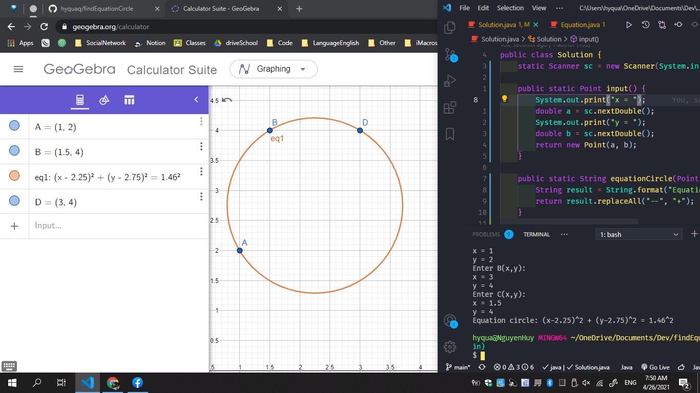

# findEquationCircle

**Give**: cho tọa độ 3 điểm A(x1, y1), B(x2, y2), C(x3, y3) tìm phương trình đường tròn có thể đi qua 3 điểm trên.

__*idea*__: ta có IA = IB && IA = IC. Rút gọn ta được 2 hệ phương trình bật nhất 2 ẩn. Tiếp ta dùng công thức Cramer để giải tìm I(x, y) nếu hệ có nghiệm là ta tìm được phương trình đường tròn.
